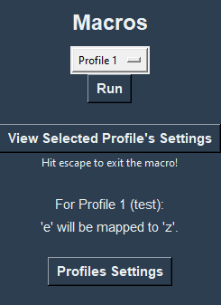

# vMacro - Desktop GUI App

Projects's Purpose / Features:

- To automate repetitive tasks
- Virtually replace keystrokes with other keystrokes for convenience
- View user's own usage data (only kept local)
- Intuitive keyboard script editor
- Functionality and theme customizability

## Program Screenshots

-> Main Window
> 

-> Macros Window
> 

-> Profile Settings Window
> 

-> Edit Profile Window
> 

-> Create New Profile Window
> 

-> Choose Recording (And Playback) Inputs Window
> 

-> Mouse & Keyboard (Or You Can Choose Them Individually) Recording And Playback Controller Window
> 

-> Keyboard Script Editor (For Playback) Window
> 

-> User Data Graph Window
> 

-> Settings Window
> 

## Usage

To run locally:

- Have Python Installed (Created With v3.9.1)
- Download Whole vMacro Folder (Whole Repo)
- cd Into Folder & "pip install -r requirements.txt"
- Run "mainWindow.py"

This project may be further updated.

Current version -> 0.9

Version 0.9 created in 10 days of starting project.

- Vamiq Valji
